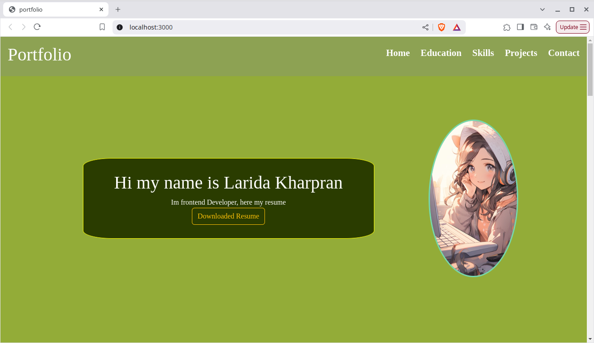

# 🌐 Personal Portfolio — Larida Kharpran

This is a **fully responsive developer portfolio website** built using **React.js**. It includes sections like **Home**, **Education**, **Skills**, **Projects**, and **Contact**, providing a dynamic and professional introduction to **Larida Kharpran**, a passionate Frontend Developer.

---

## 📸 Screenshot

  

*Main homepage section with resume download and hero image*

---

## 🚀 Live Demo

[🔗 View Portfolio Website](https://lari-portfolio-01.netlify.app/)  

---

## ✨ Features

- 🖼️ Clean and modern UI with a responsive layout
- 📁 Downloadable resume functionality
- 🧠 Educational background overview
- 💻 Tech stack and skills display
- 🧩 Dynamic project showcase section
- 📞 Contact form or section with essential links
- 🔄 Component-based modular structure

---

## 🧩 Components Breakdown

| Component   | Description |
|-------------|-------------|
| `Navbar`    | Top navigation menu to smoothly scroll to sections |
| `Home`      | Introduction with image and resume download |
| `Education` | Academic background with degrees and timelines |
| `Skills`    | Technical skills presented using icons or bars |
| `Projects`  | List of React projects with live preview & GitHub links |
| `Contact`   | Email, social links, or contact form |

---

